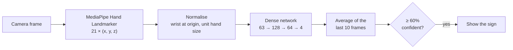
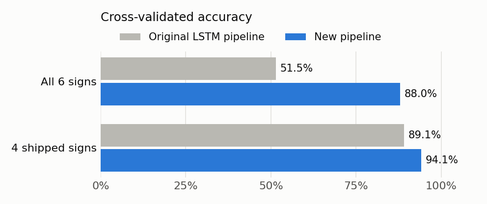
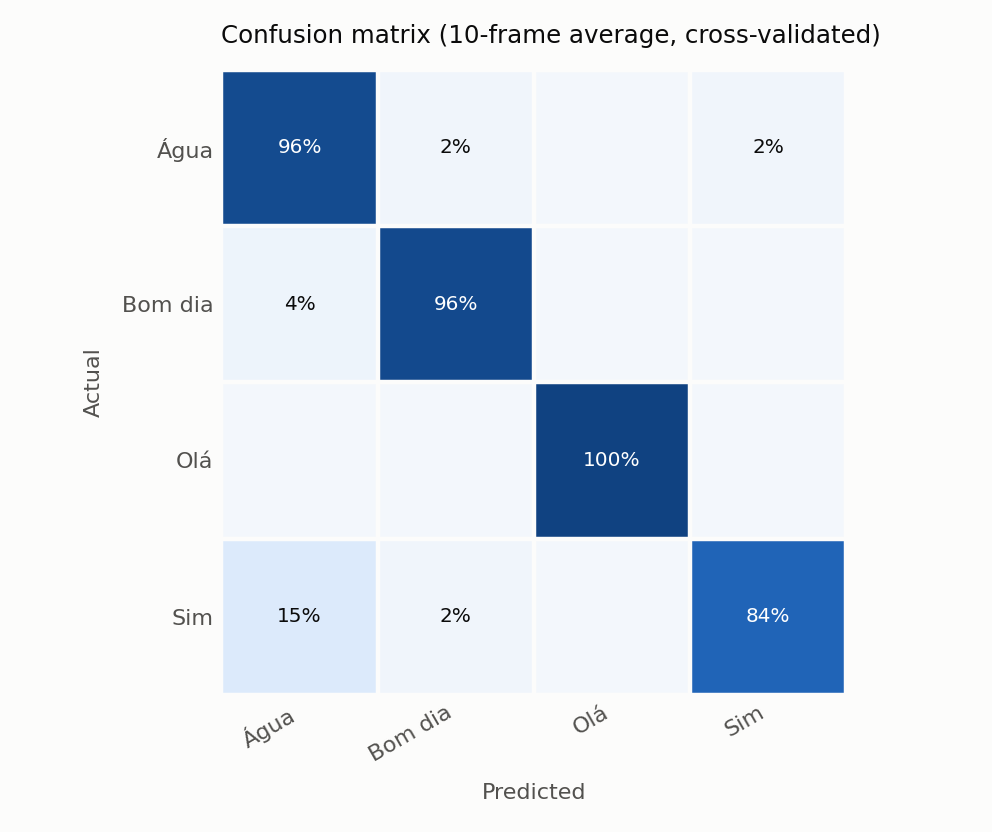

# LGP Sign Recognition

[](https://github.com/khomy86/lgp-sign-recognition/actions/workflows/ci.yml)
[](https://khomy86.github.io/lgp-sign-recognition/)

Real-time recognition of **Portuguese Sign Language (Língua Gestual Portuguesa)** hand shapes, running fully on-device, in the browser and as a native Android app.

**[Try the live demo](https://khomy86.github.io/lgp-sign-recognition/)** · **[Download the Android APK](https://github.com/khomy86/lgp-sign-recognition/releases/latest)**

## Highlights

- **End-to-end ML pipeline**: landmark extraction, training with block-wise cross-validation, and export to TensorFlow Lite and to a JSON model for the web, all from one config file.
- **Two clients, one model**: an Android app (Kotlin, Jetpack Compose, CameraX, MediaPipe, LiteRT) and a static web demo (MediaPipe JS, no framework, no build step).
- **Honest evaluation**: neighbouring dataset images are near-duplicates, so folds are contiguous blocks, not random samples. The chart below uses this evaluation for both the original and the new pipeline.
- **Tested at every layer**: Python, JavaScript and Kotlin tests check that all three implementations of the feature normalisation agree exactly, and an instrumented test runs the full on-device pipeline on an emulator in CI.

## How it works



1. **Landmarks.** [MediaPipe's hand landmarker](https://ai.google.dev/edge/mediapipe/solutions/vision/hand_landmarker) finds the hand and returns 21 3D keypoints. The classifier never sees pixels, which keeps it tiny and robust to lighting and skin tone.
2. **Normalisation.** Points are converted to pixel proportions, moved so the wrist is at the origin and divided by the hand's size. Where the hand is in the frame and how far it is from the camera stop mattering.
3. **Classification.** A 17k-parameter dense network (67 KB as TFLite) scores the hand shape in every frame. Training adds rotated, mirrored and jittered copies of each sample, so either hand works.
4. **Smoothing.** Both apps average the last 10 frames and only show a sign once the average confidence reaches 60%.

## Results

418 landmark samples of 4 signs, 5-fold block cross-validation ([`ml/artifacts/metrics.json`](ml/artifacts/metrics.json)).

<picture>
  <source media="(prefers-color-scheme: dark)" srcset="docs/images/accuracy-dark.png">
  
</picture>

| Sign | Meaning | Hand shape | Precision | Recall | F1 |
|---|---|---|---:|---:|---:|
| Água | Water | Flat hand, edge towards the camera | 0.80 | 0.96 | 0.87 |
| Bom dia | Good morning | Thumbs up | 0.96 | 0.96 | 0.96 |
| Olá | Hello | Open palm, fingers spread | 1.00 | 1.00 | 1.00 |
| Sim | Yes | Closed fist | 0.98 | 0.84 | 0.90 |

- **Averaged over 10 frames** (what the apps do): 94.1% accuracy, macro F1 0.93.
- **Single frames**: 82.5% accuracy.
- **At the 60% confidence threshold the apps use**, the model answers for 83% of 10-frame windows, and 99.5% of those answers are correct.

<details>
<summary>Confusion matrix</summary>

<picture>
  <source media="(prefers-color-scheme: dark)" srcset="docs/images/confusion-matrix-dark.png">
  
</picture>
</details>

### Why 4 signs and not 6

The dataset has six signs. Two were left out of the shipped model because they are too easy to confuse with the others given the data available. The table shows each subset evaluated with 3 random seeds:

| Signs | Accuracy (10-frame) | Macro F1 | Weakest sign F1 |
|---|---:|---:|---:|
| All 6 | 85.6% | 0.84 | 0.74 (Sim) |
| Without *Sim* | 91.8% | 0.91 | 0.84 |
| Without *Por favor* | 89.2% | 0.88 | 0.79 |
| Without *Por favor* and *Sim* | 94.6% | 0.94 | 0.85 |
| **Without *Por favor* and *Não* (shipped)** | **94.7%** | **0.94** | **0.86** |

*Por favor* (flat hand, fingers together) is too close to *Água*, and *Não* (index finger up) is often confused with *Sim* (fist). Their images stay in [`ml/dataset`](ml/dataset). Adding a gesture back is a one-line change in [`ml/config.py`](ml/config.py).

### Compared with the first version

This repository started as a university project (v1). The rebuild changed:

| | v1 | Now |
|---|---|---|
| Dataset images with a detected hand | 38% | 83% |
| Accuracy, all 6 signs (same evaluation) | 51.5% | 88.0% |
| Classifier | 3-layer LSTM, needs TF "Flex" ops | Dense network, built-in ops only |
| Android APK (universal debug build) | 481 MB | 87 MB (24 MB release for arm64) |
| Input features | Raw coordinates from tight crops, which don't match full camera frames | Normalised, so they don't depend on hand position or size |

## Repository layout

```
ml/                      Python pipeline
  dataset/               738 photos, one folder per sign
  config.py              Paths, sign names and which signs are enabled
  landmarks.py           Feature normalisation and augmentation
  extract.py             1. Photos -> hand landmarks
  train.py               2. Cross-validation, final model, charts
  export.py              3. TFLite for Android, JSON for the web
  artifacts/             Trained model, metrics, extraction stats
  tests/
android/                 Kotlin app (Compose, CameraX, MediaPipe, LiteRT)
web/                     Static web demo (plain JS + MediaPipe from a CDN)
docs/images/             README figures (generated by train.py)
```

## Running it

### ML pipeline (Python 3.11)

```bash
cd ml
python3.11 -m venv .venv && source .venv/bin/activate
pip install -r requirements.txt

python extract.py   # detect hands in every photo
python train.py     # evaluate, train, draw the charts
python export.py    # update the Android and web models
pytest tests
```

Many dataset photos are tight crops where MediaPipe's palm detector fails. `extract.py` retries each photo with added margins and mirroring, which raises detection from 38% to 83%.

### Web demo

```bash
cd web
python3 -m http.server 8000   # then open http://localhost:8000
node --test "tests/*.test.js"
```

The camera needs a secure context, which `localhost` is.

### Android app

Open `android/` in Android Studio and run the `app` configuration on a phone (Android 7.0+), or build from the command line:

```bash
cd android
./gradlew assembleRelease            # APKs in app/build/outputs/apk/release
./gradlew testDebugUnitTest          # JVM unit tests
./gradlew connectedDebugAndroidTest  # on-device pipeline test (emulator or phone)
```

Release APKs are signed with the debug key so they can be sideloaded directly.

## Limitations

- The model recognises **hand shapes**, not movement. Many LGP signs are defined by motion, which this approach can't capture.
- The dataset is small (about 120 photos per sign) and was recorded by a few people, so accuracy on new people, lighting and backgrounds will be lower than the cross-validated numbers.
- One hand at a time.

## Authors

Ivanilson Braga, Zakhar Khomyakivskyy and Ektiandro Elizabeth. Built as part of the *Laboratório de Projeto* course and later reworked by Zakhar Khomyakivskyy.
